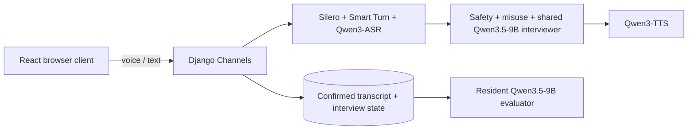

# Adaptive AI Interviewer

A local first-stage interview application built with React, TypeScript, Django, Channels and a fixed dual-GPU AI stack.

## Runtime flow



Voice turn-taking is context-aware rather than `silence == finished`: Silero rejects non-speech, Smart Turn decides whether a pause looks like a conversational handoff, and Qwen3-ASR runs only after the turn is accepted. See `docs/VOICE_PIPELINE.md`.

## Project structure

```text
backend/        Django, Channels, persistence and model orchestration
config/         Historical migration seed files retained for old-database compatibility
docs/           Architecture, models, voice, deployment, security and style
frontend/       React/TypeScript candidate application
prompts/        Interviewer, misuse and evaluation prompts
```

Primary engineering docs:

- `docs/ARCHITECTURE.md`
- `docs/VOICE_PIPELINE.md`
- `docs/MODELS.md`
- `docs/PERFORMANCE.md`
- `docs/STYLE_GUIDE.md`

## Requirements

- Python 3.12+
- Node.js + npm
- ffmpeg, git and cmake
- NVIDIA CUDA toolkit and CUDA-capable PyTorch
- two RTX 3090 GPUs for the intended deployment
- ONNX Runtime GPU support for Smart Turn

Arch Linux system tools:

```bash
sudo pacman -S ffmpeg cmake git
```

## Python setup

```bash
python -m venv .venv
source .venv/bin/activate
pip install --upgrade pip
pip install -r requirements.txt
```

Smart Turn v3.2 is downloaded from `pipecat-ai/smart-turn-v3` through the Hugging Face cache on first model load. Silero VAD is supplied by `silero-vad`. Qwen3.5-9B is loaded once through the text-only `Qwen3_5ForCausalLM` class and quantized to INT8 weights with FP16 compute by BitsAndBytes; the vision tower is not instantiated.

The inference stack uses PyTorch SDPA. The external `flash-attn` package and vLLM are not required.

## Qwen3-TTS native runtime

Qwen3-TTS uses qwentts.cpp so the main Python environment can remain on Transformers 5.

```bash
mkdir -p ~/.cache/adaptive-ai-interviewer
git clone --recurse-submodules https://github.com/ServeurpersoCom/qwentts.cpp.git ~/.cache/adaptive-ai-interviewer/qwentts.cpp
cd ~/.cache/adaptive-ai-interviewer/qwentts.cpp
git checkout a8a7716b530e49fed537c57711247c12fbbb903c
git submodule update --init --recursive
cmake -S . -B build -DGGML_CUDA=ON -DQWEN_SHARED=ON -DCMAKE_CUDA_ARCHITECTURES=86
cmake --build build -j "$(nproc)"
```

Download the matching BF16 files:

```bash
mkdir -p ~/.cache/adaptive-ai-interviewer/qwen3-tts
hf download Serveurperso/Qwen3-TTS-GGUF \
    qwen-talker-1.7b-customvoice-BF16.gguf \
    qwen-tokenizer-12hz-BF16.gguf \
    --local-dir ~/.cache/adaptive-ai-interviewer/qwen3-tts
```

## Frontend and database

```bash
npm install
python backend/manage.py migrate
```

Optional research-backed demonstration jobs:

```bash
python backend/manage.py seed_sample_jobs
```

The command is idempotent. `--reset` restores only unused sample vacancies; any Job with an application remains an immutable recruitment snapshot. See `docs/SAMPLE_JOBS.md`.

Optional admin account:

```bash
python backend/manage.py createsuperuser
```

## Development

```bash
npm run dev
```

- Django: `http://127.0.0.1:8000`
- Vite: `http://127.0.0.1:5173`

Vite proxies `/api` and `/ws` to Django. Development `runserver` preloads the complete interview/evaluation model suite in its serving child process.

## Build and tests

```bash
npm run build
npm test
```

`npm test` runs Django checks, migration drift checks, pytest and the production frontend build. Tests inject deterministic fake model services; they do not allocate real CUDA models.

## Model placement

```text
GPU 0: Qwen3.5-9B INT8 + Qwen3-TTS
GPU 1: Qwen3-ASR + Qwen3Guard + Qwen3.5-4B misuse + Smart Turn v3.2
CPU:   Silero VAD
```

Qwen3.5-9B is shared by interviewing and final evaluation and is kept entirely on GPU 0 to avoid cross-GPU layer transfers. Its Gated DeltaNet layers use Flash Linear Attention plus causal-conv1d when those optimized packages are installed; full-attention layers continue through PyTorch SDPA. See `docs/MODELS.md` for exact checkpoints and precision.

## Interview content

Staff author new vacancies directly in Django Admin. Each `Job` stores the candidate-facing description plus three internal evidence sections:

```text
essential_requirements       interview-assessable hard gates
verification_requirements    credentials/prerequisites the interview can only record as claimed
evaluation_questions         broader evidence criteria for holistic review
```

Once the first candidate applies, the recruitment specification becomes read-only so later interviews cannot silently use different criteria under the same Job record. Candidate APIs expose the public job description but not the internal rubric.

The built-in sample vacancies live in `backend/interviews/sample_jobs.py` and can be inserted with `python backend/manage.py seed_sample_jobs`. The legacy `config/` files remain only because historical migrations use them when reconstructing old database schemas from scratch.

Prompts:

```text
prompts/interviewer.txt
prompts/misuse.txt
prompts/evaluator_question.txt
prompts/evaluator_classification.txt
prompts/final_choice.txt
prompts/final_output.txt
```

The interviewer sees the hidden Job rubric and gathers evidence through role-relevant follow-ups. Evaluation stores constrained criterion classifications, Python enforces mandatory gates, and only then does Qwen make the holistic `PROGRESS` / `NOT_PROGRESS` decision.

## Voice behaviour

Open microphone is the default after explicit browser permission. The `MediaStream` stays active for the interview; pause-delimited recording segments are sent automatically. Push-to-talk remains available as an explicit closed-microphone mode.

The transcript panel uses temporary candidate/interviewer `...` bubbles while audio or AI work is pending. Temporary UI state is never persisted as interview evidence.

Raw microphone audio is processed in memory and is not stored by the application.

## Model lifecycle

`ModelRuntime` owns one process-wide model suite. Every model remains resident after startup; runtime state only serializes active inference so an interview and final evaluation do not create overlapping activation/workspace peaks.

One dual-3090 worker supports one live interview or one final evaluation at a time without an evaluator model swap.

## Accessibility and privacy

Candidates can speak, type or switch between both. The UI provides transcript text, microphone state/level, replay, rephrase, pause, voice mute, playback speed, keyboard operation, reduced-motion support and optional ASR confirmation.

See `docs/ACCESSIBILITY.md`, `docs/SECURITY.md` and `docs/DEPLOYMENT.md` before production deployment.
