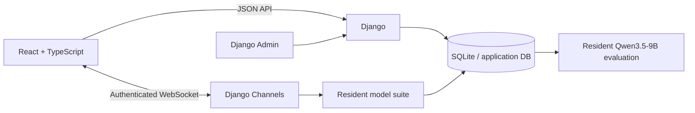
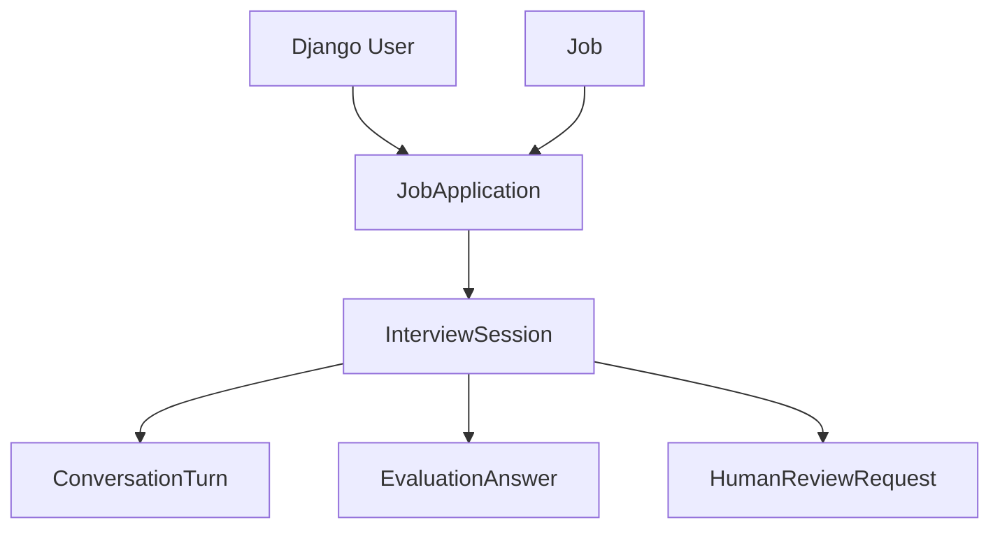
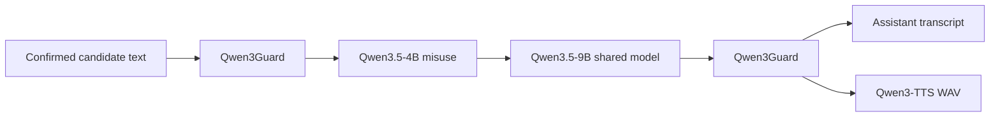
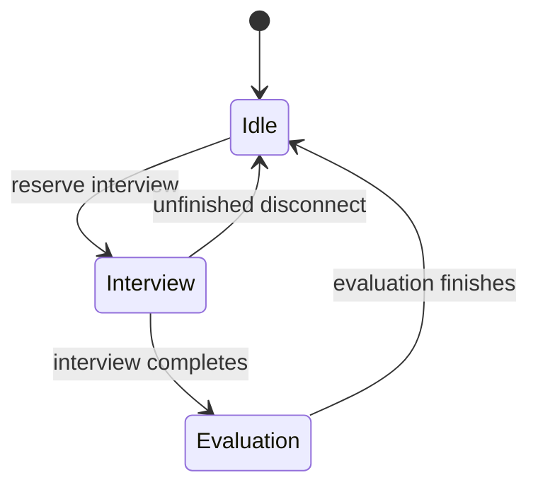
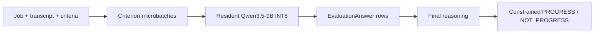

# Architecture

## System map

| Boundary | Responsibility |
| --- | --- |
| React | Candidate routing, microphone/media state, transcript UI and accessibility controls. |
| Django JSON APIs | Authentication, jobs, applications, interview setup/status and review requests. |
| Channels | One live interview connection, audio turn state and model orchestration. |
| Model runtime | Serialized inference ownership over one permanently resident dual-GPU model suite. |
| Database | Recruitment state, confirmed transcript text, criterion assessments and outcomes. |

Django does not render candidate pages. Production serves the React SPA and proxies `/api`, `/ws` and `/admin` to Django.

## Recruitment data

`Job` is an immutable recruitment snapshot containing candidate-facing metadata, the authored description and evaluation rubric. Updating `config/` affects new jobs only.

## Live interview

Typed input enters interview policy directly. Voice input first passes the turn-detection pipeline documented in [VOICE_PIPELINE.md](VOICE_PIPELINE.md).

The opening question uses a non-persisted internal user instruction so the model receives a valid chat shape without inventing candidate evidence.

## Runtime ownership

All models remain loaded in every state. `ModelRuntime` only serializes active inference so one live interview or one final evaluation generates at a time. Development `runserver` preloads the complete stack in the serving child; other ASGI processes can lazy-load it on first use.

## Evaluation

The evaluator uses Transformers directly. Criteria are independent and processed in small batches to bound dynamic VRAM while the auxiliary stack remains resident. The final decision still depends on all completed criterion assessments. Inference failure becomes `evaluation_failed`; it never fabricates a recruitment outcome.

## Persistence and privacy boundary

Persisted: accounts, jobs, applications, interview state, confirmed transcript text, evaluation answers, outcome and review requests.

Not persisted: raw microphone audio, temporary transcript typing indicators, model chain-of-thought.
