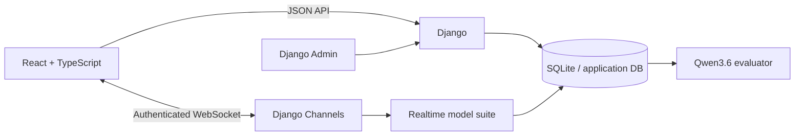
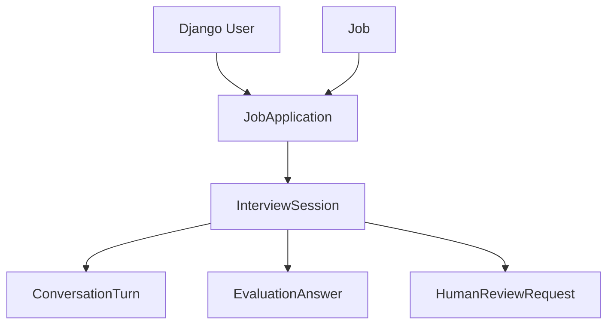
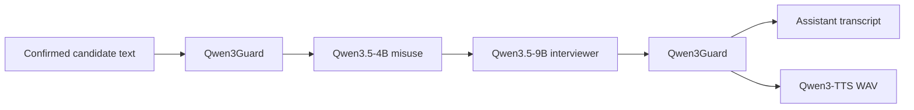
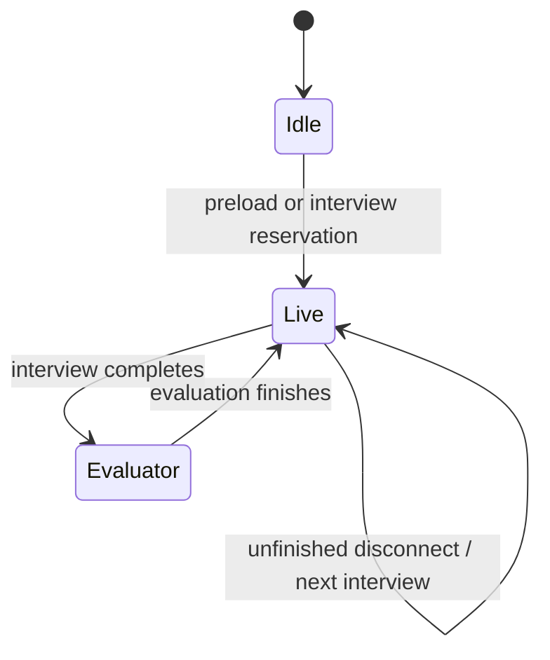

# Architecture

## System map

| Boundary | Responsibility |
| --- | --- |
| React | Candidate routing, microphone/media state, transcript UI and accessibility controls. |
| Django JSON APIs | Authentication, jobs, applications, interview setup/status and review requests. |
| Channels | One live interview connection, audio turn state and model orchestration. |
| Model runtime | Exclusive ownership of the dual-GPU live/evaluator stack. |
| Database | Recruitment state, confirmed transcript text, criterion assessments and outcomes. |

Django does not render candidate pages. Production serves the React SPA and proxies `/api`, `/ws` and `/admin` to Django.

## Recruitment data

`Job` is an immutable recruitment snapshot containing candidate-facing metadata, the authored description and evaluation rubric. Updating `config/` affects new jobs only.

## Live interview

Typed input enters interview policy directly. Voice input first passes the turn-detection pipeline documented in [VOICE_PIPELINE.md](VOICE_PIPELINE.md).

The opening question uses a non-persisted internal user instruction so the model receives a valid chat shape without inventing candidate evidence.

## Runtime ownership

`ModelRuntime` permits one live interview **or** one final evaluation per process. Development `runserver` preloads the live stack in the serving child; other ASGI processes can lazy-load it on first reservation.

## Evaluation

Final evaluation deliberately uses a separate process because the Django process has already initialized several CUDA runtimes during the live interview.

```mermaid
flowchart LR
    Input[Job + transcript + criteria] --> Spawn[Spawn clean evaluator process]
    Spawn --> Batch[vLLM criterion batch]
    Batch --> Cache[Prefix cache]
    Cache --> TP[Qwen3.6 W8A16 TP=2]
    TP --> Answers[EvaluationAnswer rows]
    Answers --> Reason[Final reasoning]
    Reason --> Choice[PROGRESS / NOT_PROGRESS]
    Choice --> Exit[Process exit + live-stack reload]
```

All criteria are independent and are submitted together; the final decision remains dependent on the completed criterion assessments. The evaluator process must exit before the realtime stack is reloaded. Inference failure becomes `evaluation_failed`; it never fabricates a recruitment outcome.

## Persistence and privacy boundary

Persisted: accounts, jobs, applications, interview state, confirmed transcript text, evaluation answers, outcome and review requests.

Not persisted: raw microphone audio, temporary transcript typing indicators, model chain-of-thought.
