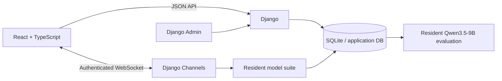
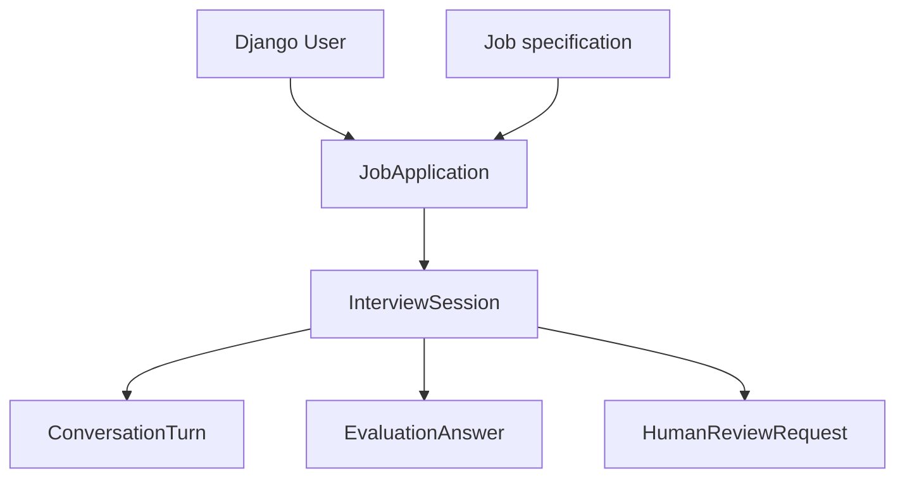
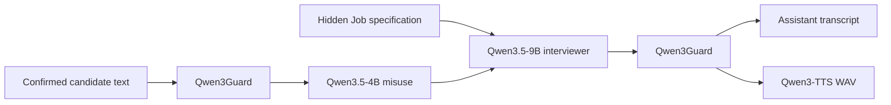
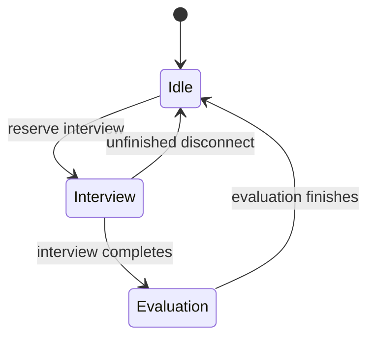
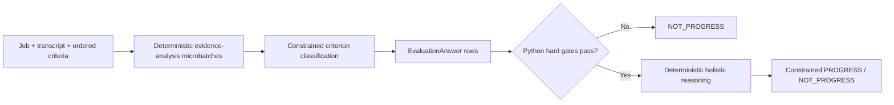

# Architecture

## System map

| Boundary | Responsibility |
| --- | --- |
| React | Candidate routing, microphone/media state, transcript UI and accessibility controls. |
| Django JSON APIs | Authentication, jobs, applications, interview setup/status and review requests. |
| Django Admin | Staff-authored vacancy specifications and review of recruitment evidence. |
| Channels | One live interview connection, audio turn state and model orchestration. |
| Model runtime | Serialized inference ownership over one permanently resident dual-GPU model suite. |
| Database | Recruitment state, immutable Job specifications, confirmed transcript text, structured criterion assessments and outcomes. |

Django does not render candidate pages. Production serves the React SPA and proxies `/api`, `/ws` and `/admin` to Django.

## Recruitment data

`Job` is the recruitment specification and source of truth. Staff author its public description, interview-assessable essential requirements, externally verifiable prerequisites and broader evaluation criteria directly in Django Admin. Once any application exists, recruitment-content fields become read-only so every candidate linked to the Job is assessed against the same snapshot. `JobApplication.job` uses `PROTECT`, so a Job with historical applications cannot be deleted accidentally.

Optional demonstration vacancies are source-controlled in `backend/interviews/sample_jobs.py` and inserted by `seed_sample_jobs`. The old `config/` job files remain only for historical migration compatibility and are not part of normal vacancy creation.

Candidate HTTP responses contain the public Job description but deliberately omit the hidden recruitment rubric and sample metadata.

## Live interview

Typed input enters interview policy directly. Voice input first passes the turn-detection pipeline documented in [VOICE_PIPELINE.md](VOICE_PIPELINE.md).

The interviewer receives the public description and internal criteria in its system context. Its role is evidence gathering: important claims trigger concrete, role-relevant follow-ups; technical depth follows the experience the candidate actually claims; isolated failure to recall niche syntax or employer-specific trivia is not treated as broad incompetence. The opening question uses a non-persisted internal user instruction so the model receives a valid chat shape without inventing candidate evidence.

## Runtime ownership

All models remain loaded in every state. `ModelRuntime` only serializes active inference so one live interview or one final evaluation generates at a time. Development `runserver` preloads the complete stack in the serving child; other ASGI processes can lazy-load it on first use.

## Evaluation

Criteria are flattened in the order `essential -> verification -> evaluation` and each stored answer records its criterion type, constrained assessment and evidence analysis. Essential requirements must classify `MET`. Verification requirements are deliberately limited to `CLAIMED`, `NOT_CLAIMED` or `UNCLEAR`; the language model never represents a candidate statement as independent credential verification. Missing hard gates force `NOT_PROGRESS` in application code before holistic model judgement runs.

Broader evaluation criteria remain evidence for the final first-stage decision rather than automatic pass/fail points. Free-form evaluation reasoning uses deterministic decoding; exact classifications and final outcomes use constrained choices. Inference failure becomes `evaluation_failed`; it never fabricates a recruitment outcome.

## Persistence and privacy boundary

Persisted: accounts, jobs, applications, interview state, confirmed transcript text, structured evaluation answers, outcome and review requests.

Not persisted: raw microphone audio, temporary transcript typing indicators, model chain-of-thought.
