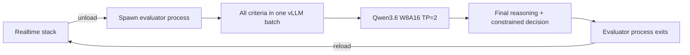

# Models

The fixed model stack is defined in `backend/interviews/services/real_models.py`, `turn_detection.py` and `evaluator_worker.py`. Device/precision changes are code changes, not candidate settings.

| Purpose | Model/source | Device | Runtime precision |
| --- | --- | --- | --- |
| Interviewer + job metadata | `Qwen/Qwen3.5-9B` | GPU 0 | INT8 weights, FP16 activations |
| Text-to-speech | `Qwen/Qwen3-TTS-12Hz-1.7B-CustomVoice` via qwentts.cpp | GPU 0 | BF16 GGUF |
| Speech recognition | `Qwen/Qwen3-ASR-1.7B-hf` | GPU 1 | BF16 |
| Turn completion | `pipecat-ai/smart-turn-v3` / `smart-turn-v3.2-gpu.onnx` | GPU 1 | FP32 ONNX |
| Voice activity detection | Silero VAD 6.2.1 | CPU | FP32 JIT |
| Content safety | `Qwen/Qwen3Guard-Gen-4B` | GPU 1 | INT8 weights, FP16 activations |
| Misuse monitoring | `Qwen/Qwen3.5-4B` | GPU 1 | INT8 weights, FP16 activations |
| Final evaluator | `Qwen/Qwen3.6-27B` base/tokenizer + `88plug/Qwen3.6-27B-W8A16` weights | GPU 0 + GPU 1 | W8A16 compressed-tensors: INT8 weights, BF16 activations |

The evaluator uses a pre-quantized W8A16 checkpoint so vLLM can use its optimized compressed-tensors path on Ampere. It does **not** use 4-bit weights or INT8 activations. The derivative checkpoint's public quality targets are not a substitute for project-specific evaluation, so recruitment decision quality should be compared against the previous INT8 evaluator before production rollout.
The vLLM evaluator uses a 32,768-token application context budget rather than the checkpoint's full native context so KV cache remains available for the concurrent criterion batch.

## Live load order

```text
GPU 0: Qwen3-TTS -> Qwen3.5-9B interviewer
GPU 1: Qwen3-ASR -> Smart Turn -> Qwen3Guard -> Qwen3.5-4B misuse
CPU:   Silero VAD
```

`RealModelSuite.load_live()` owns all live model instances. Do not create additional model copies in consumers, views or helper modules.

## Evaluation handoff



The evaluator runs text-only with tensor parallelism across both GPUs. The clean process boundary prevents the Django process's earlier CUDA state from becoming part of the vLLM runtime and guarantees model memory is released when evaluation exits.

## Speech model contracts

- Browser audio is normalized to mono 16 kHz float32 PCM before VAD, Smart Turn or ASR.
- Smart Turn evaluates up to the last 8 seconds of the current candidate turn.
- Qwen3-ASR receives the full accepted accumulated turn.
- Qwen3-TTS runs through the pinned qwentts.cpp C ABI so the main Python environment can stay on Transformers 5.
