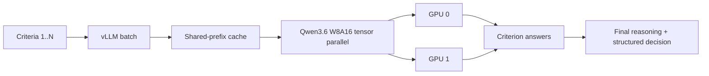

# Performance

## Live placement

```text
GPU 0 (24 GB)
  Qwen3.5-9B INT8
  Qwen3-TTS-1.7B BF16

GPU 1 (24 GB)
  Qwen3-ASR-1.7B BF16
  Qwen3Guard-Gen-4B INT8
  Qwen3.5-4B INT8
  Smart Turn v3.2 FP32

CPU
  Silero VAD
```

Smart Turn placement is an accuracy/latency choice, not a VRAM workaround. Silero remains CPU-side because its continuous VAD workload is tiny; Smart Turn only runs after pause probes.

## Evaluation throughput

The final evaluator is optimized for the actual workload: many independent criteria sharing the same job description and transcript.



| Setting | Value | Purpose |
| --- | --- | --- |
| Tensor parallel | 2 | Both GPUs participate in each model layer instead of assigning whole layer ranges to separate GPUs. |
| Criterion batch | All configured criteria | Gives the GPUs multiple active sequences instead of twelve batch-size-one generations. |
| Prefix caching | Enabled | Reuses the common job/transcript prefix across criterion prompts. |
| Model mode | Language-model-only | Skips the unused vision encoder/profiling. |
| Quantization | W8A16 compressed-tensors | 8-bit weights with BF16 activations; avoids BitsAndBytes 8-bit eager fallback. |
| GPU memory target | 0.90 per GPU | Leaves host/display headroom while retaining ample KV/cache capacity. |
| Maximum sequences | 32 | Keeps the normal 12-criterion workload schedulable in one engine. |
| Batched-token budget | 16,384 | Gives chunked prefill enough work for throughput-oriented scheduling without reserving the model's full context window. |
| Evaluator context | 32,768 tokens | Keeps KV/cache sizing realistic for a 30-minute interview instead of provisioning Qwen3.6's much larger native context. |
| CPU offload | Disabled | Keeps evaluator weights on the two GPUs and avoids host-device weight transfers during generation. |
| Eager mode | Disabled | Allows vLLM to use its compiled/CUDA-graph execution path when supported. |
| Performance mode | Throughput | Favors aggregate tokens/s for the high-concurrency criterion batch. |

The previous evaluator used Transformers `device_map='auto'` and generated one criterion at a time. That placement solved VRAM capacity but did not provide tensor-parallel execution; the new path is designed for throughput rather than model placement alone.

### Expected bottlenecks after this change

- Autoregressive decoding remains sequential per sequence; batching improves aggregate throughput rather than making one token free.
- TP=2 adds inter-GPU collectives. PCIe/NVLink topology therefore affects scaling.
- Model startup still costs tens of seconds because the live stack and evaluator cannot occupy the GPUs together. The patch improves inference throughput, not evaluator cold-load time.
- The final decision depends on all criterion answers and remains a separate generation.

### Target-host measurements

Measure before/after on the same transcript and rubric:

| Metric | Goal |
| --- | --- |
| Total criterion wall time | Materially lower than twelve sequential Transformers calls. |
| GPU 0 / GPU 1 utilization | Both cards active together during the criterion batch. |
| Prompt throughput | Higher from batching + shared-prefix reuse. |
| Output throughput | Higher aggregate tokens/s from multi-sequence scheduling. |
| VRAM | No CPU weight offload; evaluator should remain inside the two 24 GB cards. |
| Decision quality | No material regression versus the previous INT8 evaluator on a fixed evaluation set. |

Useful host-side observation:

```bash
nvidia-smi dmon -s pucm -d 1
```

vLLM's criterion progress bar also reports prompt/output token throughput.

## Voice latency path

```text
2 s browser pause probe
 -> ffmpeg decode
 -> Silero VAD
 -> Smart Turn
 -> 0.5 s completion grace OR ~6 s incomplete-turn hold
 -> Qwen3-ASR
 -> safety + misuse + interviewer
 -> Qwen3-TTS
```

The hold timer is conversational policy, not model latency. It exists only when Smart Turn considers a phrase incomplete.

## Model lifecycle

Development `runserver` preloads the live suite. Final evaluation unloads it, runs Qwen3.6 in a fresh spawned process, waits for that process to exit, then restores the live stack. One dual-3090 worker supports one live interview or one evaluation at a time.
