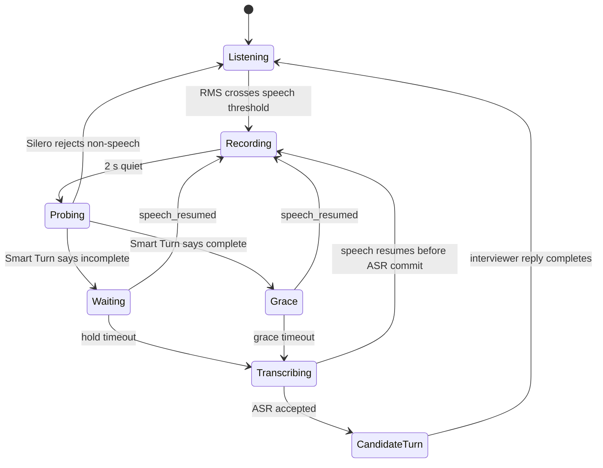

# Voice pipeline

`useInterview.ts` owns browser capture. `InterviewConsumer` owns conversational turn state. `RealModelSuite` owns model residency.

## Open microphone

```mermaid
flowchart LR
    Mic[Browser MediaStream] --> RMS[RMS speech trigger]
    RMS -->|speech| Rec[MediaRecorder]
    Rec -->|2 s quiet| WS[WebSocket segment]
    WS --> FF[ffmpeg 16 kHz mono]
    FF --> VAD[Silero VAD · CPU]
    VAD -->|non-speech| Drop[Discard]
    VAD -->|speech| Buffer[Pending turn audio]
    Buffer --> ST[Smart Turn v3.2 · GPU 1]
    ST -->|complete| Grace[0.5 s handoff grace]
    ST -->|incomplete| Hold[6 s fallback hold]
    Grace --> ASR[Qwen3-ASR · GPU 1]
    Hold --> ASR
    ASR --> Candidate[Persist candidate text]
    Candidate --> Interviewer[Qwen3.6 shared interviewer · GPU 0]
    Interviewer --> TTS[Qwen3-TTS · GPU 0]
```



The browser's two-second quiet period is a **pause probe**, not an end-of-turn decision. Speech segments remain one logical candidate turn until Smart Turn accepts the handoff or the fallback hold expires.

## Turn state



| Signal | Meaning |
| --- | --- |
| RMS threshold | Cheap browser trigger for recording; not semantic VAD. |
| Silero VAD | Rejects coughs, bumps and other segments without meaningful speech. |
| Smart Turn | Uses the accumulated current turn to estimate whether the candidate yielded the floor. |
| `speech_resumed` | Cancels a scheduled handoff as soon as the browser detects new speech. |
| Hold timeout | Prevents an unfinished phrase from holding the conversation indefinitely. |

Smart Turn receives up to the last 8 seconds of the accumulated turn, matching its published input contract. The full accumulated audio is retained for Qwen3-ASR.

## Push-to-talk

Closed microphone mode remains explicit:

```text
Speak -> record -> Finish speaking -> Silero VAD -> Qwen3-ASR -> interviewer
```

The browser sends `audio_mode.manual=true` before the binary audio frame. Manual submission still passes Silero but bypasses Smart Turn because the button press is an explicit end-of-turn signal.

## WebSocket voice messages

Browser to backend:

```json
{"type":"audio_mode","manual":false}
{"type":"speech_resumed"}
```

Audio itself remains a binary WebSocket frame.

Backend to browser:

| Message | UI effect |
| --- | --- |
| `turn_pending` | Keep the temporary candidate `...` bubble visible. |
| `audio_ignored` | Remove the temporary bubble when no real turn is pending. |
| `candidate` | Replace candidate `...` with confirmed text. |
| `status: thinking` | Show the temporary interviewer `...` bubble. |
| `assistant` | Replace interviewer `...` with the generated question/reply. |

Temporary bubbles are frontend state only. They are never stored as `ConversationTurn` records.

## Data lifetime

Raw microphone audio is decoded and buffered in process memory only. The application persists candidate/interviewer text, not microphone recordings.

## Current boundary

Resumed speech can cancel a pending handoff and can prevent ASR output from being committed if speech resumes while transcription is running. Once `process_candidate_text()` has committed a candidate turn and begun interviewer generation, that model call is not currently cancellable. True full-duplex barge-in belongs to a separate design pass.
